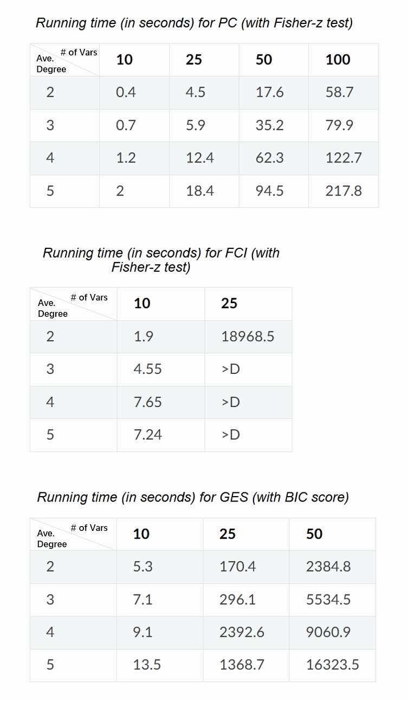

=============
Getting started
=============

Installation
^^^^^^^^^^^^

Requirements
------------

* python 3
* numpy
* networkx
* pandas
* scipy
* scikit-learn
* statsmodels
* pydot

(For visualization)

* matplotlib
* graphviz
* pygraphviz (might not support the most recent Mac)

Install via PyPI
------------

To use Pytrad, we could install it using `pip <https://pypi.org/project/sqlparse/>`_:

.. code-block:: console

   (.venv) $ pip install pytrad

Install from source
------------

For development version, please kindly refer to our `GitHub Repository <https://github.com/cmu-phil/pytrad>`_.

Running examples
^^^^^^^^^^^^

For search methods in causal discovery, there are various running examples in the 'tests' directory in our `GitHub Repository <https://github.com/cmu-phil/pytrad>`_,
such as TestPC.py and TestGES.py.

For the implemented modules, such as (conditional) independent test methods, we provide unit tests for the convenience of developing your own methods.

Quick benchmarking
^^^^^^^^^^^^

To help users get a quick sense of the running time of the algorithms of interest, we conducted benchmarking for several methods.
We consider datasets with number of variables from {10, 25, 50, 100} and average degree from {2, 3, 4, 5}.
The random graphs are Erdős-Rényi graphs.
The average degree is the average number of edges connected to a node.
We simply calculate it by dividing the sum of degrees by the total number of nodes in the graph.
The sample size is 1000.
All algorithms were run on a single cluster node with 8 CPUs (Intel Xeon E5-2470) and 16 GB Memory.
We denote running time as '>D' if it is more than one day.
All results are average over 10 runs with different random seeds.

Contributors
^^^^^^^^^^^^

**Group Leaders**: Kun Zhang, Joseph Ramsey, Shohei Shimizu, Peter Spirtes, Clark Glymour

**Coordinators**: Yujia Zheng, Mingming Gong, Biwei Huang, Wei Chen

**Developers**:
- Wei Chen, Ruichu Cai, Biwei Huang, Yuequn Liu, Zhiyi Huang: :ref:`PC <pc>`, :ref:`FCI <fci>`, :ref:`GES <ges>`, :ref:`GIN <gin>`, and :ref:`graph operaitions <graphoperation>`.
- Mingming Gong, Erdun Gao: :ref:`PNL <pnl>`, :ref:`ANM <anm>`, :ref:`Granger causality <granger>`, and :ref:`KCI <Kernel-based conditional independence (KCI) test and independence test>`.
- Shohei Shimizu, Takashi Nicholas Maeda, Takashi Ikeuchi: :ref:`LiNGAM-based methods <lingam>`.
- Madelyn Glymour: several helpers.
- Ruibo Tu: :ref:`Missing-value/test-wise deletion PC <pc>`.
- Wai-Yin Lam: :ref:`PC <pc>`.
- Biwei Huang: :ref:`CD-NOD <cdnod>`.
- Ignavier Ng, Yujia Zheng: :ref:`Exact search <exactsearch>`.
- Joseph Ramsey, Wei Chen, Zhiyi Huang: :ref:`Evaluations <evaluation>`.

