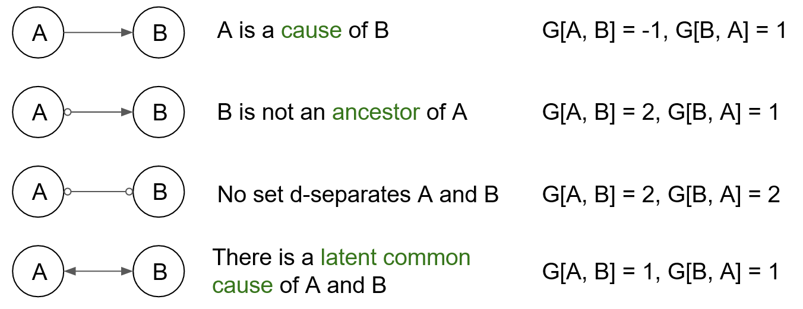

.. _fci:

FCI
=====

Algorithm Introduction
--------------------------------------

Causal Discovery with Fast Causal Inference (FCI [1]_).

Usage
----------------------------
.. code-block:: python

    from causallearn.search.ConstraintBased.FCI import fci

    G, edges = fci(data, independence_test_method, alpha, depth, max_path_length,
        verbose, background_knowledge, cache_variables_map)

    # visualization
    from causallearn.utils.GraphUtils import GraphUtils

    pdy = GraphUtils.to_pydot(G)
    pdy.write_png('simple_test.png')

Visualization using pydot is recommended. If specific label names are needed, please refer to this `usage example <https://github.com/cmu-phil/causal-learn/blob/main/tests/TestGraphVisualization.py>`_.

Parameters
-------------------
**dataset**: numpy.ndarray, shape (n_samples, n_features). Data, where n_samples is the number of samples
and n_features is the number of features.

**independence_test_method**: Independence test method function. Default: 'fisherz'.
       - ":ref:`fisherz <Fisher-z test>`": Fisher's Z conditional independence test.
       - ":ref:`chisq <Chi-Square test>`": Chi-squared conditional independence test.
       - ":ref:`gsq <G-Square test>`": G-squared conditional independence test.
       - ":ref:`kci <Kernel-based conditional independence (KCI) test and independence test>`": kernel-based conditional independence test. (As a kernel method, its complexity is cubic in the sample size, so it might be slow if the same size is not small.)
       - ":ref:`mv_fisherz <Missing-value Fisher-z test>`": Missing-value Fisher's Z conditional independence test.

**alpha**: Significance level of individual partial correlation tests. Default: 0.05.

**depth**: The depth for the fast adjacency search, or -1 if unlimited. Default: -1.

**max_path_length**: the maximum length of any discriminating path, or -1 if unlimited. Default: -1.

**verbose**: True is verbose output should be printed or logged. Default: False.

**background_knowledge**: class BackgroundKnowledge. Add prior edges according to assigned causal connections. Default: None.
For detailed usage, please kindly refer to its `usage example <https://github.com/cmu-phil/causal-learn/blob/main/tests/TestBackgroundKnowledge.py>`_.

**cache_variables_map**: This variable a map which contains the variables relate with cache. If it is not None, it should contain 'data_hash_key' 、'ci_test_hash_key' and 'cardinalities'. Default: None.

Returns
-------------------
**G**: a CausalGraph object, where G is a PAG and the illustration of its end nodes is as follows:

**edges**: list. Contains graph's edges properties. If edge.properties have the Property 'dd', then there is no latent confounder. Otherwise, there might be latent confounders. If edge.properties have the Property 'nl', then it is definitely direct. Otherwise, it is possibly direct.

.. [1] Spirtes, P., Meek, C., & Richardson, T. (1995, August). Causal inference in the presence of latent variables and selection bias. In Proceedings of the Eleventh conference on Uncertainty in artificial intelligence (pp. 499-506).
